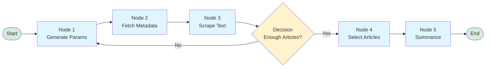

# Building a News TL;DR Agent with LangGraph: A Complete Guide

## Table of Contents
1. [Introduction: What Are AI Agents?](#introduction)
2. [What We're Building](#what-were-building)
3. [Frameworks and Technologies](#frameworks-and-technologies)
4. [Understanding LangGraph](#understanding-langgraph)
5. [System Architecture](#system-architecture)
6. [Code Structure Overview](#code-structure-overview)
7. [Tools and External Services](#tools-and-external-services)
8. [Setting Up API Keys](#setting-up-api-keys)
9. [Challenges and Solutions](#challenges-and-solutions)
10. [Getting Started](#getting-started)
11. [Conclusion](#conclusion)

---

## Introduction: What Are AI Agents? {#introduction}

### Understanding AI Agents

An **AI Agent** is an autonomous software system that can perceive its environment, make decisions, and take actions to achieve specific goals. Unlike traditional programs that follow rigid, predefined instructions, AI agents use Large Language Models (LLMs) to reason, plan, and execute tasks dynamically.

Think of the difference like this:

**Traditional Program:**
```
If user_query == "news":
    fetch_news()
    display_results()
```
Rigid, predefined, can't adapt.

**AI Agent:**
```
User asks: "What's happening with AI today?"
→ Agent understands the intent
→ Generates optimal search parameters
→ Fetches relevant articles
→ Selects most relevant ones
→ Summarizes them intelligently
```
Flexible, intelligent, adaptive.

### Why AI Agents for News Summarization?

News summarization is a perfect use case for AI agents because:

1. **Dynamic Content**: News changes constantly—agents can adapt to new topics
2. **Complex Decision-Making**: Need to select relevant articles from thousands
3. **Multi-Step Process**: Search → Filter → Scrape → Select → Summarize
4. **Intelligent Filtering**: LLMs understand context better than keyword matching
5. **Natural Language Understanding**: Users can ask questions naturally

### Real-World Analogy

Imagine a research assistant:
- **Traditional Search**: You type keywords, get results, manually read and summarize
- **AI Agent**: You ask "What's the latest on AI?" and it:
  - Understands your intent
  - Searches multiple sources intelligently
  - Filters out irrelevant articles
  - Reads and summarizes the most important ones
  - Presents you with concise bullet points

---

## What We're Building {#what-were-building}

### The News TL;DR Agent

A sophisticated news summarization system that:

1. **Takes a natural language query** (e.g., "AI news today")
2. **Intelligently searches** multiple news sources using NewsAPI
3. **Scrapes full article content** from web pages
4. **Selects the most relevant articles** using AI
5. **Generates concise summaries** in bullet-point format
6. **Presents formatted results** ready for consumption

### Key Features

- **Intelligent Search**: LLM generates optimal search parameters
- **Adaptive Workflow**: Automatically adjusts search strategy if not enough articles found
- **Multi-Source**: Aggregates from BBC, CNN, TechCrunch, and more
- **Full-Text Analysis**: Scrapes complete articles, not just headlines
- **Smart Selection**: AI chooses most relevant articles based on query
- **Concise Summaries**: Bullet-point TL;DRs for quick reading

### Use Cases

- **Staying Current**: Get daily summaries on topics you care about
- **Research**: Quickly understand multiple perspectives on a topic
- **News Monitoring**: Track developments in specific industries
- **Content Creation**: Gather information for articles or reports

---

## Frameworks and Technologies {#frameworks-and-technologies}

### LangGraph: The Orchestration Engine

**What it is**: LangGraph is a library for building stateful, multi-actor applications with LLMs. It extends LangChain by adding graph-based workflow orchestration.

**Why we use it**:
- **State Management**: Maintains context across multiple steps
- **Conditional Routing**: Makes decisions about what to do next
- **Cyclical Workflows**: Can loop back to previous steps if needed
- **Error Handling**: Built-in mechanisms for handling failures
- **Visualization**: Can visualize the workflow as a graph

**Key Concepts**:
- **Nodes**: Individual processing steps (functions)
- **Edges**: Connections between nodes (can be conditional)
- **State**: Shared data structure passed between nodes
- **Graph**: The overall workflow structure

### OpenAI GPT-4o-mini: The Intelligence

**What it is**: OpenAI's language model that powers the agent's decision-making and summarization.

**Why we use it**:
- **Natural Language Understanding**: Interprets user queries accurately
- **Parameter Generation**: Creates optimal search parameters
- **Article Selection**: Identifies most relevant articles
- **Summarization**: Generates concise, informative summaries
- **Cost-Effective**: GPT-4o-mini balances quality and cost

**Three LLM Calls in Our Workflow**:
1. **Search Parameter Generation**: Converts user query into NewsAPI parameters
2. **Article Selection**: Chooses most relevant articles from candidates
3. **Summarization**: Creates bullet-point summaries

### NewsAPI: The Data Source

**What it is**: A REST API that provides access to news articles from thousands of sources.

**Why we use it**:
- **Comprehensive Coverage**: 30,000+ news sources
- **Structured Data**: Returns metadata (title, URL, description, date)
- **Search Capabilities**: Filter by keywords, sources, dates, language
- **Free Tier**: 100 requests/day for development
- **Reliable**: Well-maintained and documented

**Limitations**:
- Free tier: Articles 1 day to 1 month old
- Rate limits: 100 requests/day on free tier
- Metadata only: Returns URLs, not full article text

### BeautifulSoup: The Web Scraper

**What it is**: A Python library for parsing HTML and extracting data from web pages.

**Why we use it**:
- **Full Article Text**: NewsAPI only provides URLs—we need full content
- **HTML Parsing**: Extracts text from complex web page structures
- **Robust**: Handles various HTML formats and structures
- **Simple API**: Easy to use for text extraction

**Why We Need It**:
NewsAPI provides article metadata but not full text. To generate meaningful summaries, we need the complete article content, which requires scraping the actual web pages.

### Streamlit: The User Interface

**What it is**: A Python framework for building interactive web applications.

**Why we use it**:
- **Rapid Development**: Build UIs with Python only
- **Interactive Components**: Sliders, text inputs, buttons built-in
- **Real-time Updates**: Dynamic content without page refreshes
- **Easy Deployment**: Can deploy to Streamlit Cloud
- **Beautiful Defaults**: Modern, clean interface out of the box

---

## Understanding LangGraph {#understanding-langgraph}

### The Graph Paradigm

LangGraph uses a **graph-based approach** where:
- **Nodes** = Processing steps (functions)
- **Edges** = Flow of execution (can be conditional)
- **State** = Shared data structure

### How It Works



### State Management

The **GraphState** is a TypedDict that holds all data as it flows through the workflow:

```python
GraphState = {
    "news_query": "AI news today",
    "num_searches_remaining": 10,
    "newsapi_params": {...},
    "past_searches": [...],
    "articles_metadata": [...],
    "scraped_urls": [...],
    "potential_articles": [...],
    "tldr_articles": [...],
    "formatted_results": "..."
}
```

Each node receives the state, processes it, updates it, and returns it. The next node receives the updated state.

### Conditional Routing

LangGraph's power comes from **conditional edges**—decisions about what to do next:

```python
def articles_text_decision(state):
    if not enough_articles and searches_remaining:
        return "generate_newsapi_params"  # Loop back
    elif enough_articles:
        return "select_top_urls"  # Proceed
    else:
        return "END"  # Stop
```

This allows the workflow to:
- **Adapt**: Try different search strategies if needed
- **Retry**: Loop back to search more if not enough articles
- **Terminate**: Stop when goals are met or resources exhausted

### Why Graph-Based?

Traditional sequential code:
```python
def process():
    step1()
    step2()
    step3()
    # Can't easily loop back or make decisions
```

Graph-based approach:
```python
graph = Graph()
graph.add_node("step1", step1)
graph.add_node("step2", step2)
graph.add_conditional_edges("step2", decide_next)
# Can loop, branch, or terminate based on state
```

---

## System Architecture {#system-architecture}

### High-Level Architecture

```mermaid
graph TB
    subgraph Input["Input Layer"]
        User[User Query<br/>"AI news today"]
        Config[Configuration<br/>Articles, Searches]
    end
    
    subgraph LangGraph["LangGraph Workflow"]
        State[GraphState<br/>Shared State Object]
        
        subgraph Nodes["Processing Nodes"]
            GenParams[Generate NewsAPI Params<br/>LLM Call #1]
            FetchMeta[Fetch Article Metadata<br/>NewsAPI]
            ScrapeText[Scrape Article Text<br/>BeautifulSoup]
            SelectArticles[Select Top Articles<br/>LLM Call #2]
            Summarize[Generate TL;DR<br/>LLM Call #3+]
            Format[Format Results]
        end
        
        Decision[Decision Logic<br/>Enough Articles?]
    end
    
    subgraph External["External Services"]
        NewsAPI[NewsAPI<br/>Article Metadata]
        WebPages[Web Pages<br/>Full Article Text]
        OpenAI[OpenAI GPT-4o-mini<br/>LLM]
    end
    
    subgraph Output["Output Layer"]
        Results[Formatted Results<br/>Article Summaries]
    end
    
    User --> State
    Config --> State
    State --> GenParams
    GenParams --> OpenAI
    OpenAI --> State
    State --> FetchMeta
    FetchMeta --> NewsAPI
    NewsAPI --> State
    State --> ScrapeText
    ScrapeText --> WebPages
    WebPages --> State
    State --> Decision
    Decision -->|Loop| GenParams
    Decision -->|Proceed| SelectArticles
    SelectArticles --> OpenAI
    OpenAI --> State
    State --> Summarize
    Summarize --> OpenAI
    OpenAI --> State
    State --> Format
    Format --> Results
    
    style User fill:#e1f5ff
    style Results fill:#d4edda
    style OpenAI fill:#d1ecf1
    style State fill:#fff3cd
    style Decision fill:#f8d7da
```

### Workflow Steps Explained

#### Step 1: Generate NewsAPI Parameters
**Node**: `generate_newsapi_params`
- **Input**: User query, past searches, remaining attempts
- **Process**: LLM analyzes query and generates optimal search parameters
- **Output**: Structured parameters (keywords, sources, date range, etc.)
- **Why LLM**: Understands intent better than keyword extraction

#### Step 2: Fetch Article Metadata
**Node**: `retrieve_articles_metadata`
- **Input**: NewsAPI parameters
- **Process**: Calls NewsAPI to get article metadata
- **Output**: List of articles with title, URL, description
- **Why NewsAPI**: Provides structured access to thousands of sources

#### Step 3: Scrape Article Text
**Node**: `retrieve_articles_text`
- **Input**: Article URLs
- **Process**: Uses BeautifulSoup to extract full text from web pages
- **Output**: Articles with complete text content
- **Why Scrape**: NewsAPI only provides URLs, not full content

#### Step 4: Decision Logic
**Function**: `articles_text_decision`
- **Checks**: Do we have enough articles? Are searches remaining?
- **Decisions**:
  - Loop back if not enough articles and searches remain
  - Proceed if enough articles found
  - End if no articles or no searches left
- **Why Conditional**: Adapts strategy based on results

#### Step 5: Select Top Articles
**Node**: `select_top_urls`
- **Input**: All scraped articles with descriptions
- **Process**: LLM selects most relevant articles based on query
- **Output**: Filtered list of selected articles
- **Why LLM**: Understands relevance better than keyword matching

#### Step 6: Generate Summaries
**Node**: `summarize_articles_parallel`
- **Input**: Selected articles with full text
- **Process**: LLM generates bullet-point summaries for each article
- **Output**: Summarized articles
- **Why LLM**: Creates concise, informative summaries

#### Step 7: Format Results
**Node**: `format_results`
- **Input**: Summarized articles
- **Process**: Formats into readable output
- **Output**: Final formatted string
- **Why Format**: Makes results user-friendly

---

## Code Structure Overview {#code-structure-overview}

### Project Organization

```
News TL;DR agent/
├── agents.py          # LangGraph workflow definition
├── config.py          # Configuration and API setup
├── tools.py           # External API integrations
├── utils.py           # Helper functions and data models
├── main.py            # CLI entry point
├── streamlit_app.py   # Web UI
├── requirements.txt   # Dependencies
└── README.md           # Documentation
```

### File-by-File Overview

#### `agents.py` - The Workflow Engine

**Purpose**: Defines the complete LangGraph workflow

**Key Components**:
- **GraphState**: TypedDict defining the state structure
- **Node Functions**: Six functions that process the state
- **Decision Function**: Determines workflow routing
- **Graph Construction**: Builds and compiles the workflow graph

**High-Level Flow**:
```python
# Define state structure
GraphState = TypedDict(...)

# Define node functions
def generate_newsapi_params(state) -> state
def retrieve_articles_metadata(state) -> state
def retrieve_articles_text(state) -> state
def select_top_urls(state) -> state
def summarize_articles_parallel(state) -> state
def format_results(state) -> state

# Decision logic
def articles_text_decision(state) -> str

# Build graph
workflow = Graph()
workflow.add_node(...)
workflow.add_edge(...)
workflow.add_conditional_edges(...)
app = workflow.compile()
```

**Why This Structure**:
- **Separation of Concerns**: Each node has a single responsibility
- **State-Based**: All data flows through shared state
- **Modular**: Easy to add, remove, or modify nodes
- **Testable**: Each function can be tested independently

#### `config.py` - Configuration Management

**Purpose**: Centralizes configuration and API initialization

**Key Components**:
- **Environment Variables**: Loads API keys from `.env`
- **LLM Initialization**: Sets up OpenAI client
- **NewsAPI Initialization**: Sets up NewsAPI client
- **Logging Setup**: Configures application logging
- **Validation**: Checks API keys are configured

**Why Centralized**:
- **Single Source of Truth**: All config in one place
- **Easy Updates**: Change settings without touching code
- **Security**: API keys loaded from environment, not hardcoded
- **Validation**: Ensures required config is present

#### `tools.py` - External Integrations

**Purpose**: Handles interactions with external services

**Key Functions**:
- **fetch_article_metadata()**: Calls NewsAPI to get article metadata
- **scrape_article_text()**: Uses BeautifulSoup to extract article text
- **filter_new_articles()**: Removes already-processed articles

**Why Separate Module**:
- **Reusability**: Functions can be used independently
- **Testability**: Easy to mock for testing
- **Maintainability**: Changes to APIs isolated here
- **Error Handling**: Centralized error handling for external calls

#### `utils.py` - Helper Functions

**Purpose**: Provides utility functions and data models

**Key Components**:
- **NewsApiParams**: Pydantic model for NewsAPI parameters
- **format_date()**: Date formatting utilities
- **extract_urls_from_text()**: URL extraction from text
- **create_initial_state()**: State initialization helper

**Why Utilities**:
- **DRY Principle**: Don't repeat code
- **Consistency**: Standardized formatting and parsing
- **Type Safety**: Pydantic models ensure data structure
- **Reusability**: Functions used across multiple modules

#### `main.py` - CLI Interface

**Purpose**: Command-line entry point

**Features**:
- **Argument Parsing**: Handles command-line arguments
- **Configuration Validation**: Checks API keys before running
- **Async Execution**: Runs the async workflow
- **Error Handling**: Graceful error messages

**Why CLI**:
- **Automation**: Can be scripted or scheduled
- **Debugging**: Easy to test with different parameters
- **Integration**: Can be called from other scripts
- **Flexibility**: Supports various use cases

#### `streamlit_app.py` - Web Interface

**Purpose**: User-friendly web UI

**Features**:
- **Interactive Input**: Text input for queries
- **Configuration Sliders**: Adjust articles and searches
- **Progress Indicators**: Real-time status updates
- **Formatted Display**: Beautiful article presentation
- **Example Queries**: Quick-start buttons

**Why Streamlit**:
- **Rapid Development**: Build UI with Python only
- **User-Friendly**: Non-technical users can interact
- **Visual Feedback**: Progress bars and status messages
- **Deployment Ready**: Easy to deploy to cloud

---

## Tools and External Services {#tools-and-external-services}

### Why We Need Multiple Tools

Our agent needs to:
1. **Search** for articles (NewsAPI)
2. **Access** full article content (Web Scraping)
3. **Understand** and process (OpenAI LLM)
4. **Present** results (Streamlit)

Each tool serves a specific purpose in the pipeline.

### NewsAPI: The Article Discovery Engine

**What it does**: Provides structured access to news articles from thousands of sources.

**Why we use it**:
- **Scale**: Can't manually check thousands of news sites
- **Structure**: Returns consistent, structured data
- **Filtering**: Built-in search, date, and source filters
- **Reliability**: Well-maintained API with good uptime

**How we use it**:
1. LLM generates search parameters (keywords, sources, dates)
2. We call NewsAPI with these parameters
3. NewsAPI returns article metadata (title, URL, description)
4. We use this to find articles to scrape

**Limitations**:
- Free tier: 100 requests/day
- Articles: 1 day to 1 month old only
- Metadata only: No full article text

### BeautifulSoup: The Content Extractor

**What it does**: Parses HTML and extracts text content from web pages.

**Why we use it**:
- **Full Content**: NewsAPI only provides URLs
- **Summarization Needs**: Need full text for meaningful summaries
- **Flexibility**: Works with various HTML structures
- **Reliability**: Mature, well-tested library

**How we use it**:
1. Get article URL from NewsAPI
2. Fetch HTML from the web page
3. Parse HTML with BeautifulSoup
4. Extract text content
5. Store for summarization

**Challenges**:
- **Blocking**: Some sites block automated scraping
- **Structure**: Different sites have different HTML structures
- **Rate Limits**: Need to be respectful of server resources

### OpenAI GPT-4o-mini: The Intelligence Layer

**What it does**: Provides natural language understanding and generation.

**Why we use it**:
- **Understanding**: Interprets user queries accurately
- **Generation**: Creates search parameters intelligently
- **Selection**: Identifies most relevant articles
- **Summarization**: Generates concise, informative summaries

**How we use it** (Three calls):

1. **Parameter Generation**:
   - Input: User query, past searches
   - Output: Structured NewsAPI parameters
   - Why: Understands intent better than keyword extraction

2. **Article Selection**:
   - Input: Article descriptions, user query
   - Output: List of relevant article URLs
   - Why: Understands relevance beyond keyword matching

3. **Summarization**:
   - Input: Full article text
   - Output: Bullet-point summary
   - Why: Extracts key points intelligently

**Why GPT-4o-mini**:
- **Cost-Effective**: Good balance of quality and cost
- **Fast**: Quick response times
- **Capable**: Handles our use cases well
- **Reliable**: Stable API with good uptime

---

## Setting Up API Keys {#setting-up-api-keys}

### Required API Keys

You need two API keys:
1. **OpenAI API Key**: For LLM calls
2. **NewsAPI Key**: For article metadata

### Getting Your OpenAI API Key

1. **Sign Up/Login**:
   - Go to https://platform.openai.com/
   - Create an account or log in

2. **Navigate to API Keys**:
   - Click your profile icon (top right)
   - Select "API keys" or go to https://platform.openai.com/api-keys

3. **Create New Key**:
   - Click "Create new secret key"
   - Give it a name (e.g., "News TL;DR Agent")
   - Copy the key immediately (you won't see it again!)

4. **Add Credits**:
   - Go to "Billing" → "Payment methods"
   - Add a payment method (required for API usage)
   - Set up usage limits if desired

**Important Notes**:
- Keys start with `sk-`
- Keep keys secret—never commit to version control
- Free tier: $5 credit for new accounts
- Pay-as-you-go after free credit

### Getting Your NewsAPI Key

1. **Sign Up**:
   - Go to https://newsapi.org/
   - Click "Get API Key"
   - Create a free account

2. **Get Your Key**:
   - After signup, you'll see your API key on the dashboard
   - Copy the key

3. **Free Tier Limits**:
   - 100 requests per day
   - Articles 1 day to 1 month old
   - Development use only

**Important Notes**:
- Free tier is sufficient for development
- For production, consider paid plans
- Key is shown only once—save it securely

### Setting Up Your `.env` File

1. **Create `.env` File**:
   ```bash
   cd "News TL;DR agent"
   cp .env.example .env
   ```

2. **Add Your Keys**:
   ```env
   OPENAI_API_KEY=sk-your-actual-key-here
   NEWSAPI_KEY=your-newsapi-key-here
   ```

3. **Verify**:
   ```bash
   python -c "import config; print(config.validate_config())"
   ```

**Security Best Practices**:
- ✅ Never commit `.env` to version control
- ✅ Add `.env` to `.gitignore`
- ✅ Use different keys for development/production
- ✅ Rotate keys if compromised
- ✅ Set usage limits in OpenAI dashboard

### Troubleshooting API Keys

**"OPENAI_API_KEY not found"**:
- Check `.env` file exists in project directory
- Verify key is on a single line (no line breaks)
- Ensure no extra spaces around the `=` sign
- Restart your terminal/IDE after creating `.env`

**"NEWSAPI_KEY not found"**:
- Same checks as above
- Verify key is correct from NewsAPI dashboard

**"Invalid API Key"**:
- Check key is copied correctly (no extra characters)
- Verify key hasn't been revoked
- For OpenAI: Check billing is set up
- For NewsAPI: Check you're not over rate limits

**Rate Limit Errors**:
- **OpenAI**: Check usage in dashboard, may need to upgrade
- **NewsAPI**: Free tier is 100/day, wait or upgrade

---

## Challenges and Solutions {#challenges-and-solutions}

### Challenge 1: NewsAPI Parameter Handling

**Problem**: Python's `from` is a reserved keyword, but NewsAPI uses it for date filtering.

**Solution**: NewsAPI Python client uses `from_param` instead of `from`:
```python
# Correct
api_params = {'from_param': '2024-01-01'}

# Wrong
api_params = {'from': '2024-01-01'}  # Syntax error!
```

**Lesson**: Always check library documentation for parameter names.

### Challenge 2: Web Scraping Reliability

**Problem**: Not all websites allow scraping, and HTML structures vary.

**Solutions**:
- **User-Agent Headers**: Simulate a browser to avoid blocking
- **Error Handling**: Gracefully handle failed scrapes
- **Timeout**: Set timeouts to avoid hanging
- **Fallback**: Continue with other articles if one fails

**Code Approach**:
```python
try:
    text = scrape_article_text(url)
    if text:
        articles.append(text)
except Exception as e:
    logger.warning(f"Failed to scrape {url}: {e}")
    # Continue with next article
```

### Challenge 3: Recursion Limits

**Problem**: LangGraph has a default recursion limit (25 steps) to prevent infinite loops.

**Solution**: Our decision logic ensures termination:
- Tracks `num_searches_remaining` (decrements each search)
- Stops when limit reached or enough articles found
- Prevents infinite loops

**Best Practice**: Always have clear termination conditions in conditional workflows.

### Challenge 4: Article Selection Quality

**Problem**: How to select the "best" articles from many candidates?

**Solution**: Use LLM for intelligent selection:
- Provide article descriptions (not just keywords)
- LLM understands context and relevance
- Better than simple keyword matching

**Why It Works**: LLMs understand semantic similarity, not just exact matches.

### Challenge 5: Cost Management

**Problem**: Multiple LLM calls can get expensive.

**Solutions**:
- **Use GPT-4o-mini**: Cost-effective for our use case
- **Limit Articles**: Default to 3 articles (configurable)
- **Limit Searches**: Default to 10 searches (configurable)
- **Efficient Prompts**: Keep prompts concise but effective

**Cost Estimation** (approximate):
- Parameter generation: ~500 tokens
- Article selection: ~1000 tokens
- Summarization: ~2000 tokens per article
- Total for 3 articles: ~$0.01-0.02 per query

### Challenge 6: Rate Limits

**Problem**: Both OpenAI and NewsAPI have rate limits.

**Solutions**:
- **NewsAPI**: Free tier is 100/day—sufficient for development
- **OpenAI**: Pay-as-you-go, but monitor usage
- **Error Handling**: Gracefully handle rate limit errors
- **Caching**: Could add caching for repeated queries (future enhancement)

### Challenge 7: State Management Complexity

**Problem**: Managing state across multiple async steps can be complex.

**Solution**: LangGraph's state management:
- **TypedDict**: Type-safe state structure
- **Immutable Updates**: Each node returns new state
- **Automatic Passing**: LangGraph handles state passing
- **Clear Structure**: All data in one place

**Why It Works**: Centralized state makes debugging and understanding easier.

### Challenge 8: Async/Await Complexity

**Problem**: Mixing async LLM calls with sync web scraping.

**Solution**: 
- Use `asyncio.run()` for CLI
- Streamlit handles async automatically
- Keep sync operations (scraping) in separate functions
- Use async only where needed (LLM calls)

**Best Practice**: Only use async where it provides benefits (I/O operations).

---

## Getting Started {#getting-started}

### Prerequisites

- Python 3.8 or higher
- OpenAI API key
- NewsAPI key
- Internet connection

### Installation Steps

1. **Clone/Navigate to Project**:
   ```bash
   cd "News TL;DR agent"
   ```

2. **Create Virtual Environment** (recommended):
   ```bash
   python -m venv venv
   source venv/bin/activate  # On Windows: venv\Scripts\activate
   ```

3. **Install Dependencies**:
   ```bash
   pip install -r requirements.txt
   ```

4. **Set Up API Keys**:
   ```bash
   cp .env.example .env
   # Edit .env and add your keys
   ```

5. **Verify Installation**:
   ```bash
   python -c "import config; print(config.validate_config())"
   ```

### Running the Application

**Command Line**:
```bash
python main.py "AI news today"
```

**Streamlit UI**:
```bash
streamlit run streamlit_app.py
```

### First Query

Try a simple query:
```bash
python main.py "technology news" --articles 2
```

This will:
1. Search for technology news
2. Find and scrape articles
3. Select 2 most relevant
4. Generate summaries
5. Display results

### Understanding the Output

You'll see:
- **Search terms used**: What parameters were generated
- **Articles found**: Number of articles discovered
- **Articles scraped**: Successfully extracted text
- **Selected articles**: Which ones were chosen
- **Summaries**: Bullet-point TL;DRs

### Next Steps

1. **Experiment**: Try different queries
2. **Adjust Parameters**: Change number of articles/searches
3. **Explore Code**: Understand how each component works
4. **Customize**: Modify prompts or add features
5. **Deploy**: Consider deploying Streamlit app to cloud

---

## Conclusion {#conclusion}

### What We've Built

A sophisticated AI agent that:
- Understands natural language queries
- Intelligently searches news sources
- Extracts and analyzes article content
- Generates concise summaries
- Presents results beautifully

### Key Takeaways

1. **AI Agents** are powerful for complex, multi-step tasks
2. **LangGraph** provides excellent workflow orchestration
3. **Multi-Tool Integration** enables sophisticated capabilities
4. **State Management** is crucial for complex workflows
5. **Error Handling** makes systems robust

### The Power of Composition

This agent demonstrates how combining:
- **LLMs** (intelligence)
- **APIs** (data access)
- **Web Scraping** (content extraction)
- **Graph Workflows** (orchestration)

Creates something more powerful than any component alone.

### Future Enhancements

Possible improvements:
- **RAG Integration**: Add knowledge base for better context
- **Caching**: Store results to reduce API calls
- **Multi-Language**: Support queries in different languages
- **Sentiment Analysis**: Analyze article sentiment
- **Topic Clustering**: Group related articles
- **Export Options**: PDF, JSON, or email summaries
- **Scheduled Queries**: Daily/weekly automated summaries

### Learning Resources

- **LangGraph Docs**: https://langchain-ai.github.io/langgraph/
- **OpenAI API Docs**: https://platform.openai.com/docs
- **NewsAPI Docs**: https://newsapi.org/docs
- **Streamlit Docs**: https://docs.streamlit.io/

### Final Thoughts

Building AI agents is about:
- **Breaking down problems** into manageable steps
- **Choosing the right tools** for each step
- **Orchestrating workflows** intelligently
- **Handling edge cases** gracefully
- **Iterating and improving** continuously

This News TL;DR agent is a great example of how modern AI tools can be combined to create practical, useful applications. The principles here apply to many other domains: customer support, data analysis, content creation, and more.

Happy building! 🚀

---

*This tutorial is part of the Generative AI Projects collection. For more AI agent examples and tutorials, check out the other projects in this repository.*

