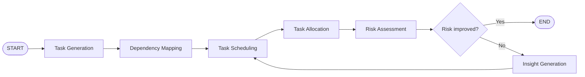
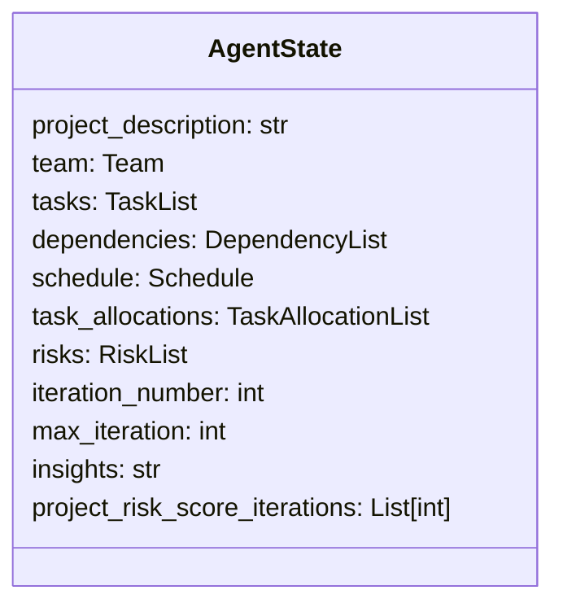
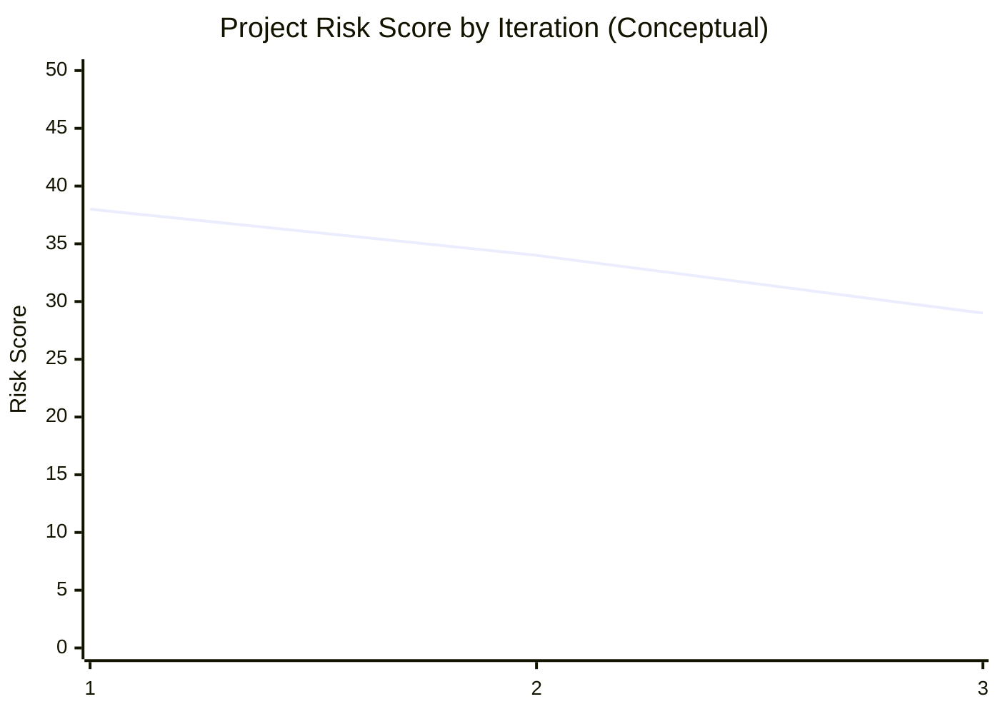

# Project Manager Assistant Tutorial (Substack-ready)

Project planning often starts with ambiguity: a high-level idea, a mixed-skill team, and limited time to create a reliable execution plan.  
This tutorial shows how to build a **Project Manager Assistant Agent** that turns a project description into:

- actionable tasks
- dependency mapping
- execution schedule
- team-member allocations
- risk-aware iterative improvements

It is written as a high-level architecture and implementation guide, not a line-by-line code walkthrough.

---

## What is an AI agent?

An **AI agent** is a system where a language model does more than answer one prompt.  
It can:

- break work into steps
- use tools and structured outputs
- keep state between steps
- improve its own results through feedback loops

In short, an agent is a workflow engine around an LLM, not just a chatbot.

For project planning, this matters because planning is naturally multi-step:
1) identify work, 2) sequence dependencies, 3) assign owners, 4) estimate risks, 5) refine.

---

## Why use an agent for project initiation?

Manual project setup is slow and error-prone, especially when:

- task dependencies are complex
- teams are cross-functional
- ownership decisions impact risk and timeline

The Project Manager Assistant helps by converting unstructured input into structured plans, then iterating to reduce risk.

---

## Frameworks and libraries used

### Core Frameworks

- **LangGraph**: orchestrates the multi-step workflow as a graph of nodes.
- **LangChain / langchain-openai**: provides model integrations and structured output interfaces.
- **Pydantic**: enforces schema-driven outputs (`Task`, `Schedule`, `RiskList`, etc.) for reliability.

### Utility Libraries

- **python-dotenv**: loads API keys and configuration from `.env`.
- **pandas**: reads team input from CSV and supports result shaping.
- **plotly / networkx / pyvis**: optional visualization stack for timeline and dependency exploration.

### Why this stack?

- It balances **speed of development** and **production readiness**.
- Structured outputs reduce brittle parsing logic.
- Graph-based orchestration keeps planning steps explicit and debuggable.

---

## Model providers and APIs

This project supports two providers:

- **Azure OpenAI** (`AzureChatOpenAI`)
- **OpenAI** (`ChatOpenAI`)

Model used in both paths: `gpt-4o-mini`.

Why this model:
- strong reasoning for planning tasks
- affordable and fast enough for iterative loops
- works well with structured output generation

---

## Architecture at a glance

The assistant is a **single orchestrated agent** with multiple specialized planning nodes (not multiple independent chatbots).



This creates a self-reflection cycle: schedule and allocation are reworked based on risk insights.

---

## State design: shared memory for the workflow

A central state object carries all intermediate and final outputs:

- project description
- team members and profiles
- tasks
- dependencies
- schedule
- task allocations
- risks and aggregate risk score
- iteration history and insights



Why this matters:
- every node reads from and writes to shared context
- results are traceable per iteration
- debugging and auditing become easier

---

## Tools, tasks, and node responsibilities

Each node is a specialized “task performer” in the workflow:

- **Task Generation**
  - transforms project narrative into realistic actionable tasks
  - splits long tasks into smaller chunks

- **Dependency Mapping**
  - identifies what must happen before what
  - builds a dependency structure for downstream scheduling

- **Task Scheduling**
  - assigns start/end windows
  - respects dependencies and parallelization opportunities

- **Task Allocation**
  - matches tasks to team member expertise
  - avoids overlapping assignments for the same member

- **Risk Assessment**
  - scores each task (0-10) based on complexity, resources, and sequencing pressure
  - computes aggregate project risk per iteration

- **Insight Generation**
  - proposes practical improvements (resource shifts, schedule changes, risk mitigation)
  - feeds recommendations back into scheduling/allocation loop

---

## High-level file overview (no line-by-line)

### `app.py`
- Defines schemas and workflow state
- Implements node functions and routing logic
- Compiles LangGraph and runs it from CLI inputs
- Prints progression and final risk trend

### `requirements.txt`
- Captures the dependency set needed for orchestration, LLM calls, parsing, and optional visualization

### `README.md`
- Quick-start instructions
- environment variables
- expected input files
- run commands and output interpretation

### `tutorial.md` (this file)
- Substack-ready narrative and conceptual guide

---

## Input format expected by the agent

You provide:

1) **Project description file** (text)  
2) **Team CSV** with columns:
- `Name`
- `Profile Description`

This keeps the interface simple and practical for PM onboarding workflows.

---

## How to get API keys

### Option A: Azure OpenAI

You need:

- `AZURE_OPENAI_API_KEY`
- `OPENAI_API_VERSION`
- `AZURE_OPENAI_ENDPOINT`

Typical steps:
1. Create/choose an Azure subscription.
2. Create an Azure OpenAI resource.
3. Deploy `gpt-4o-mini` (or compatible deployment).
4. Copy endpoint, key, and API version into `.env`.

### Option B: OpenAI

You need:

- `OPENAI_API_KEY`
- `OPENAI_API_BASE` (optional, depending on your setup)

Typical steps:
1. Create an OpenAI account.
2. Generate an API key from the dashboard.
3. Add it to `.env`.

---

## Example `.env`

```bash
# Azure path
AZURE_OPENAI_API_KEY=your_key_here
OPENAI_API_VERSION=your_version_here
AZURE_OPENAI_ENDPOINT=https://your-resource.openai.azure.com/

# OpenAI path (if using OpenAI instead of Azure)
OPENAI_API_KEY=your_key_here
OPENAI_API_BASE=https://api.openai.com/v1
```

---

## Running the agent

```bash
cd "agents/project-manager-assistant"
python -m pip install -r requirements.txt

python app.py \
  --project-file "../data/project_manager_assistant/project_description.txt" \
  --team-csv "../data/project_manager_assistant/team.csv" \
  --model-provider Azure \
  --max-iteration 3
```

The run prints node progression and final risk scores by iteration.

---

## Illustration: iterative risk trend concept



Even when scores do not decrease every run, the loop still acts as a structured quality check over schedule and ownership decisions.

---

## Practical challenges and trade-offs

### 1) Risk scoring variability
LLMs can assign slightly different scores across runs, even with similar inputs.

**Mitigation ideas:**
- add scoring rubrics with stricter criteria
- enforce deterministic post-processing rules
- average scores across multiple runs for stability

### 2) Prompt adherence is not guaranteed
The model can occasionally miss constraints (for example, overlapping assignments).

**Mitigation ideas:**
- add validation nodes after allocation/scheduling
- auto-repair invalid outputs before moving forward

### 3) Scalability for large projects
Huge task graphs increase token usage and latency.

**Mitigation ideas:**
- split planning into phases
- summarize completed iterations
- introduce batched or hierarchical planning

### 4) Real-world dynamics
The plan may ignore sudden constraints (sickness, leave, urgent blockers).

**Mitigation ideas:**
- add human-in-the-loop approval checkpoints
- enable fast re-planning with partial state updates

---

## Why this multi-step design beats one-shot prompting

A single prompt can generate a project plan, but it is harder to:

- preserve strict structure for downstream automation
- diagnose where planning went wrong
- iterate based on measurable quality signals (like risk trend)

The LangGraph design gives you modularity and observability:
- each node has a clear responsibility
- each iteration captures data you can audit and improve

---

## Where to take this next

- Add calendar integration for true team availability
- Introduce cost/budget constraints in allocation
- Add optimization algorithms (CP-SAT / ILP) after LLM extraction
- Add PM UI (timeline + risk dashboard)
- Add policy rules (seniority caps, workload fairness thresholds)

---

## TL;DR

This Project Manager Assistant shows how to move from “chat answer” to **agentic planning system**:

- structured tasks from raw project text
- dependency-aware scheduling
- skill-aware allocation
- risk scoring and iterative self-improvement

It is a strong baseline for AI-assisted project initiation and can evolve into a production planning copilot with validation and optimization layers.
