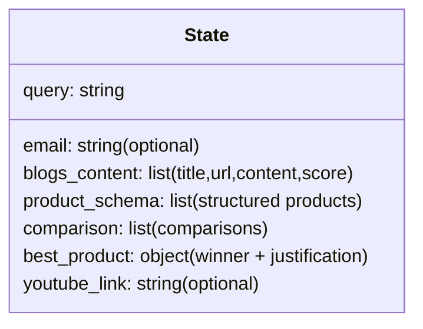

# Shopping Agent Tutorial (Substack-ready)

Shopping Agent is an **agentic shopping assistant** built with **LangGraph** that can search the web, extract product options into a structured format, compare them, choose a best pick, and optionally share a YouTube review link + email the recommendation.

This tutorial explains the “why” and “how” at a high level—**no line-by-line code walkthrough**—so you can understand the architecture, tools, and practical setup.

---

## What is an AI agent?

An **AI agent** is a system that uses a language model (LLM) plus **tools** and **state** to complete tasks more reliably than a single prompt.

Instead of asking an LLM “pick the best phone” in one shot, an agent typically:

- **Plans/executes steps** (implicitly or explicitly)
- **Calls tools** (web search, browsers, APIs, databases, email, etc.)
- **Maintains state** across steps (what it found, what it decided, what to do next)
- **Produces a final answer** grounded in tool outputs

In Shopping Agent, the “tools” are things like Tavily web search, web page loading, YouTube search, and SMTP email sending.

---

## Why LangGraph for agents?

Shopping Agent uses **LangGraph** because it makes agent workflows **explicit and controllable**:

- **Graph-based orchestration**: define steps (nodes) and how data flows between them (edges)
- **Stateful execution**: a single state object carries everything through the workflow
- **Composable**: easy to add/replace steps (e.g., add a price checker node later)
- **More predictable** than a purely autonomous “agent loop” when you want consistent outputs

Think of LangGraph as a “workflow engine” for LLM-powered pipelines.

---

## The core stack (frameworks + tools)

### Frameworks

- **LangGraph**: orchestrates the workflow as a directed graph
- **LangChain**: provides building blocks (prompting, parsers, loaders)
- **Pydantic**: defines strict output schemas for extraction and comparison

### Tools (APIs)

- **Tavily**: web search for product roundups/reviews
- **Groq (LLM)**: Llama 3.1 70B via `langchain-groq` for structured extraction + comparisons
- **YouTube Data API**: fetch a review video link for the winning product
- **SMTP (Gmail)**: email the recommendation (optional)

### Why these tools?

- **Tavily**: fast web search with structured results (title/url/score)
- **Groq**: very fast inference for large models; good for “extract → structure → compare”
- **YouTube**: adds user trust and “social proof” by pointing to a review video
- **Email**: turns the agent into a “delivery system” (recommendation arrives where users are)

---

## Shopping Agent workflow architecture

Shopping Agent is not “many agents” talking to each other; it’s a **multi-step graph** (a pipeline) where each node is a specialized capability.

### Workflow diagram

```mermaid
flowchart LR
  A([START]) --> B[Tavily Search]
  B --> C[Load Blog Content]
  C --> D[Schema Mapping (Pydantic JSON)]
  D --> E[Product Comparison (Pydantic JSON)]
  E --> F[YouTube Review Link (optional)]
  F --> G[Display / Final Result]
  F --> H[Send Email (optional)]
  G --> I([END])
  H --> I
```

### State: the “shared memory” of the workflow

Every node reads/writes into a single state object. Conceptually:



This design makes the system debuggable: you can inspect intermediate artifacts like `blogs_content` and `product_schema`.

---

## “Structured output” is the secret sauce

Raw web text is messy. Shopping Agent uses **schemas** to reduce chaos:

- **Extraction schema**: turn blog text into a list of product candidates with pros/cons/highlights
- **Comparison schema**: make the model compare products in a consistent format and select a winner

This improves:

- **Reliability** (less “random formatting”)
- **Downstream usability** (easy to render in UI or store in DB)
- **Auditing** (you can show where the decision came from)

---

## Codebase overview (high level)

Shopping Agent lives in:

- `agents/shopping-agent/app.py`
- `agents/shopping-agent/requirements.txt`
- `agents/shopping-agent/README.md`

### `app.py` (what’s inside)

At a high level, it contains:

- **Environment setup**: loads API keys from `.env` / environment variables
- **Client builders**:
  - Groq LLM client (`ChatGroq`)
  - Tavily client (`TavilyClient`)
  - YouTube client (optional)
- **Schemas** (Pydantic models):
  - extraction (`ListOfProductReviews`)
  - comparison (`ProductComparison`)
  - email payload (`EmailRecommendation`)
- **Nodes** (graph steps):
  - search + load content
  - map content → schema
  - compare + choose best product
  - fetch YouTube review link (optional)
  - send email (optional)
- **Graph assembly**: connects nodes into a workflow
- **CLI entrypoint**: `python app.py --query "..."`

This single-file structure is great for sharing and learning; later you can split it into `src/` modules if it grows.

### `requirements.txt`

Pinned to the **LangChain 0.2.x** family to align with other agents in this repo and avoid dependency drift.

---

## Getting API keys (step-by-step)

### Groq API key (LLM)

- Create an account on Groq and generate an API key.
- Set it as `GROQ_API_KEY`.

### Tavily API key (web search)

- Create a Tavily account and generate a key.
- Set it as `TAVILY_API_KEY`.

### YouTube Data API key (optional)

1. Create a Google Cloud project
2. Enable **YouTube Data API v3**
3. Create an API key credential
4. Set it as `YOUTUBE_API_KEY`

### Gmail SMTP (optional email)

To send emails reliably with Gmail:

1. Enable 2‑factor authentication on your Google account
2. Create an **App Password**
3. Set:
   - `GMAIL_USER` = your Gmail address
   - `GMAIL_PASS` = the app password

---

## Running Shopping Agent locally

### Install dependencies

```bash
cd "agents/shopping-agent"
python -m pip install -r requirements.txt
```

### Create a `.env` file

```bash
GROQ_API_KEY=...
TAVILY_API_KEY=...

# optional:
YOUTUBE_API_KEY=...
GMAIL_USER=...
GMAIL_PASS=...
```

### Run

```bash
python app.py --query "Best smartphones under $1000" --pretty
```

---

## Real-world challenges (and how Shopping Agent handles them)

### 1) Web content is noisy

- Many pages include navigation, ads, and unrelated text.
- Shopping Agent uses a web loader and extracts text, but pages can still be messy.

**Mitigation ideas**:
- Increase `TAVILY_MAX_RESULTS` and compare across multiple sources
- Add a “source quality filter” node (domain allowlist, minimum content length, etc.)

### 2) “One source” can bias recommendations

If the search only pulls one roundup article, you risk inheriting that author’s bias.

**Mitigation ideas**:
- Pull 3–5 sources and aggregate
- Add a “consensus scoring” node

### 3) Structured output can fail

LLMs sometimes produce invalid JSON or incomplete fields.

Shopping Agent includes:
- **Pydantic-based parsing** (strict structure)
- **Retry logic** for extraction (configurable retries/wait)

### 4) Rate limits and costs

- Tavily and YouTube can rate-limit.
- LLM calls cost tokens/time.

**Mitigation ideas**:
- Cache Tavily results
- Add a “summarize per page” step before extraction
- Add a budget limiter (max pages / max tokens)

### 5) Dependency conflicts across many agents

Multi-agent repos often have mixed LangChain versions.

Shopping Agent’s `requirements.txt` is pinned to the 0.2.x line to match common setups; for production, prefer **one venv per agent** (or a monorepo lockfile strategy).

---

## Where to take Shopping Agent next (upgrade path)

If you want “next-level” shopping intelligence:

- **Price + availability**: add a node that checks live prices from retailer APIs
- **RAG memory**: store past preferences (“I like compact phones”) and reuse them
- **Evaluation**: add tests that ensure schema validity and stable outputs for sample queries
- **UI**: Streamlit/Next.js UI that visualizes comparisons and source links

---

## TL;DR

Shopping Agent is a practical example of an agentic workflow:

- **Search** → **Extract to schema** → **Compare** → **Recommend** → (optional) **YouTube** + **Email**

The architecture is simple, extensible, and designed around **structured outputs** so you can reliably build on top of it.

